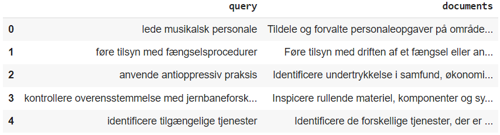
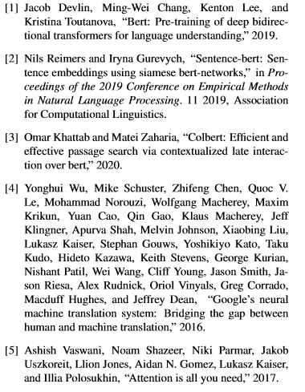

# Categorising labour market skills into EU's taxonomy of skills
* This repo contains my code for the DTU exam project in Deep Learning.
* The code reproducing the main result of the paper can be found in the notebook called main.ipynb.

## What to expect
In this project I propose a matching model to assign skills written in a natural language into a common EU taxonomy with 13,845 unique skill categories. Applying a pre-trained sentence BERT model shows surprisingly good results for matching skills from the EU taxonomy into a description of the skill itself. By embedding the skill and their descriptions separately, and matching them back together, the model predicts 1 in 5 skills to the correct description of itself. Moreover, 50.7\% of predictions are correctly placed among the 10 most semantically similar descriptions. With fine-tuning of the model it has potential for an implementation as a labour market matching application.

## Data
The data used to evaluate the model is EU's taxonomy of skills called ESCO. This dataset contains 13,485 unique skills with each a description. For a grasp of what this data looks see below, where the query column contains the skills and the document column contains the respective descriptions of skills (all in Danish). 

## References
